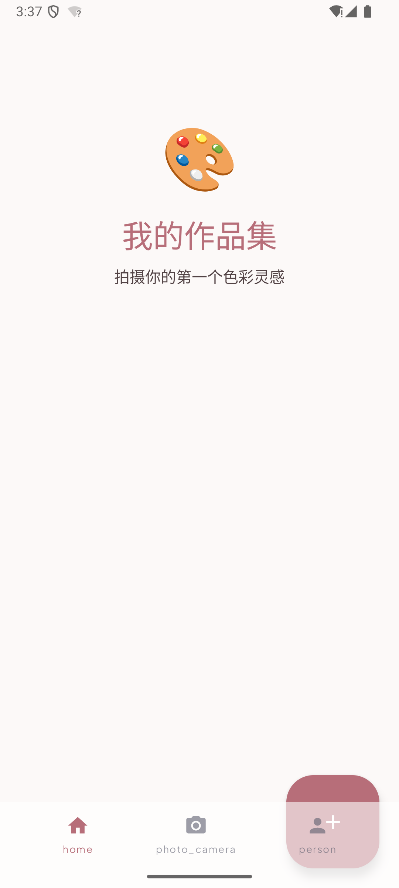
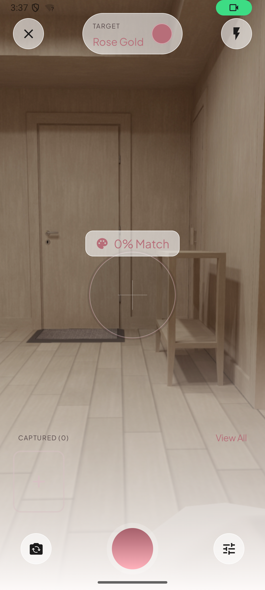

# Palette Muse

> Capture daily aesthetics — photos of outfits and objects — and curate them into
> personal color themes.

An Android app for turning the colors of everyday life into curated, shareable
themes. Snap an outfit or object, Palette Muse extracts its dominant color and
matches it against your themes by perceptual color distance, then renders the
result as a moodboard poster.

<p align="center">
  
  &nbsp;
  
</p>

## Highlights

- **Themes over palettes.** A *theme* is one representative color plus the photos
  captured against it — the unit the app curates and you browse.
- **Perceptual color matching.** Each capture gets a 0–100 *match score* against
  every theme; only matches above the threshold count.
- **Swatches & shade ramp.** Themes show a representative color plus up to two
  standout captures; posters are styled with a graduated shade ramp.
- **Poster export.** Compose a moodboard and export it as a shareable image.
- **Aura Aesthetic design system.** Minimalism + glassmorphism, Rose Gold /
  Soft Lavender / Pearl White, Playfair Display × Plus Jakarta Sans.

## Tech stack

| Concern        | Library                                            |
|----------------|----------------------------------------------------|
| UI             | Jetpack Compose + Material 3                       |
| Navigation     | Jetpack Navigation 3                               |
| DI             | Hilt                                               |
| Persistence    | Room                                               |
| Camera         | CameraX                                            |
| Color          | androidx.palette                                   |
| Images         | Coil 3                                             |
| Motion         | Lottie                                             |
| Async          | Kotlin Coroutines                                  |

Min SDK targets modern Android; built with AGP 9, Kotlin 2.3.

## Getting started

```bash
# 1. Clone
git clone https://github.com/raawaa/palette-muse.git
cd palette-muse

# 2. Open in Android Studio (Ladybug or newer), or build from the CLI:
./gradlew assembleDebug

# 3. Install on a connected device/emulator
./gradlew installDebug
```

> The app requires a device with a camera (`uses-feature android.hardware.camera`).

## Project structure

```
app/src/main/java/com/palettemuse/
├── camera/            # CameraX lifecycle-bound camera management
├── core/              # Color extraction, matching & naming (pure logic)
├── data/
│   ├── local/         # Room database, DAOs
│   ├── model/         # Entities (Photo, Theme)
│   └── repository/    # ThemeMatcher, ThemeRepository, PosterExporter
├── di/                # Hilt modules
├── theme/             # Aura Aesthetic tokens, typography, shapes
└── ui/                # Feature screens (home, capture, theme, export) + ViewModels
```

The ubiquitous language that names these concepts lives in
[CONTEXT.md](CONTEXT.md); the visual design system is documented in
[DESIGN.md](DESIGN.md).

## Testing

```bash
./gradlew test               # JVM unit tests
./gradlew connectedAndroidTest  # instrumentation tests (device/emulator)
```

## Documentation

- [CONTEXT.md](CONTEXT.md) — ubiquitous language & domain model
- [DESIGN.md](DESIGN.md) — Aura Aesthetic design system
- [docs/](docs/) — architecture & agent workflow notes

## Contributing

Contributions are welcome. Please open an issue first to discuss what you'd
like to change. Issues live on [GitHub Issues](https://github.com/raawaa/palette-muse/issues) — see [`docs/agents/issue-tracker.md`](docs/agents/issue-tracker.md) for conventions.

## License

Licensed under the Apache License, Version 2.0. See [LICENSE](LICENSE).

```
Copyright 2026 raawaa

Licensed under the Apache License, Version 2.0 (the "License");
you may not use this file except in compliance with the License.
You may obtain a copy of the License at

    http://www.apache.org/licenses/LICENSE-2.0

Unless required by applicable law or agreed to in writing, software
distributed under the License is distributed on an "AS IS" BASIS,
WITHOUT WARRANTIES OR CONDITIONS OF ANY KIND, either express or implied.
See the License for the specific language governing permissions and
limitations under the License.
```
